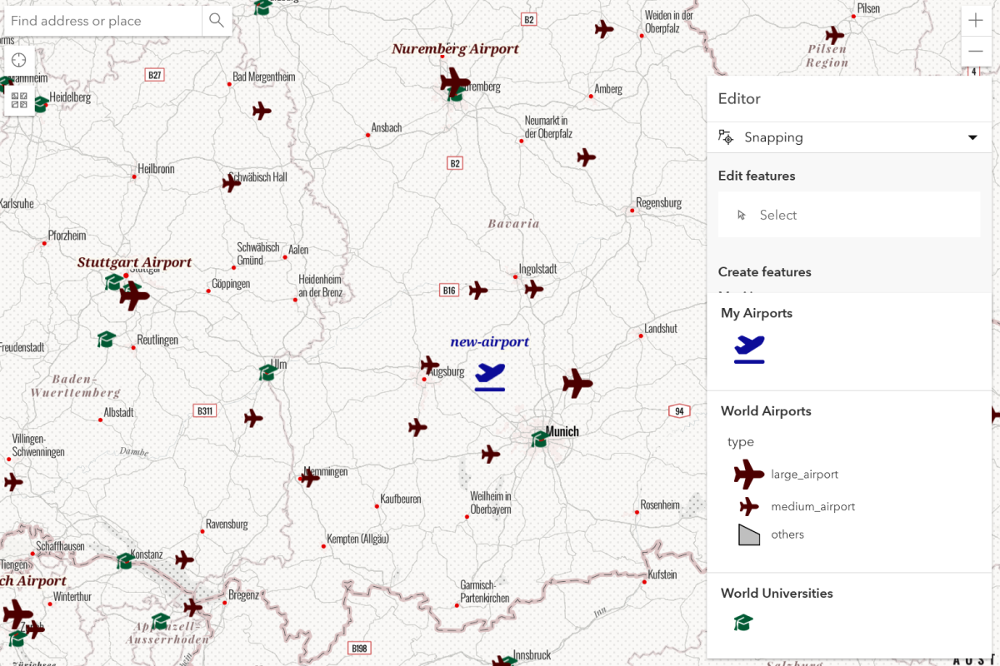

# geog576_lab2
A repo for UW-Mad Geog 576 Lab 3

## Project Summary
This project is a web map using ArcGIS Online JavaScript code to create a web-map with JavaScript and various hosted datasources.
<ul>
  <li>Basemap & basemap gallery provided by ESRI</li>
  <li>Point features for airports by <a href = "https://www.arcgis.com/home/item.html?id=e90996158f0a464189098881379597a6&view=list&sortOrder=desc&sortField=defaultFSOrder#">ESRI Deutschland</a>.</li>
  <li>Point features for universities by <a href="https://www.arcgis.com/home/item.html?id=d1debc35ad254fe1886a26b7ab42be6b&view=list&sortOrder=desc&sortField=defaultFSOrder#">j_nelson</a>.</li>
</ul>
Link to live project hosted on github: https://steslowj.github.io/geog576_lab3/

